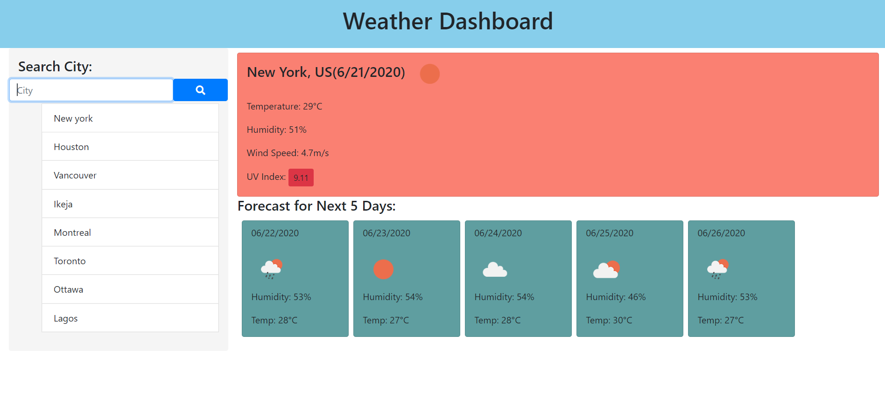

# WeatherDashBoard
Weather Dashboard that retrieves informatio used from the Open Weather API

## User Story
AS A traveler
I WANT to see the weather outlook for multiple cities
SO THAT I can plan a trip accordingly

## How To Use
- Search for the city who's weather info you're looking for
- If city is valid, the current day weather and the forecast for the next 5 days will be shown
- If city is invalid, the previous searched city will be shown
- If there was no previous city, then no information will be shown

## Screenshot
The screenshot shown below displays the functionality of the application:

